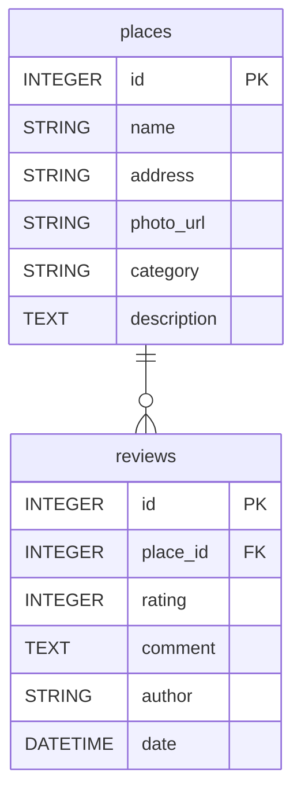

# Проект "Сириус путеводитель" для всероссийского ИТ-раунда

## Требования
- Python 3.12
- Docker
- Poetry

## Установка
1. Склонируйте репозиторий
```bash
git clone git@github.com:n9dn9/sirius-it.git
```

2. По примеру из **.env.example** создайте .env файл с переменными окружения

## Настройка
1. При необходимости измените конфигурацию .env 

## Запуск
1. Запустите проект
```bash
docker compose up --build
// при повторном запуске флаг build можно опустить
```
Сайт будет доступен на порту **80**

2. Чтобы выключить проект достаточно прожать Ctrl+C в терминале где был запущен Docker-compose

## Er-cхема

